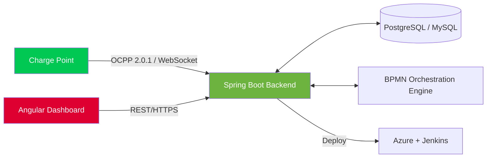

<!--
Marcelo Domingues — GitHub Profile README
Tema: consola de estação de carregamento EV (OCPP), porque é literalmente o que construo.
-->

<div align="center">


<a href="https://www.linkedin.com/in/marcelogdomingues" target="_blank"></a>
<a href="https://github.com/marcelogdomingues" target="_blank"></a>


</div>

---

### 🔌 Boot sequence

```
$ ocpp-charge-point --connect marcelogdomingues
[00:00.1] BootNotification.req  → vendor: "Java/Spring", model: "Backend Engineer"
[00:00.3] Central System        → BootNotification.conf: Accepted
[00:00.4] StatusNotification    → connectorId: 1, status: "Available"
[00:00.6] Authorize.req         → idToken: "curious-minds"
[00:00.7] Authorize.conf        → status: Accepted
[00:01.0] Session started       → currently building: remote config for chargers over OCPP 2.0.1
[00:01.2] Meanwhile             → exploring BPMN orchestration & async deployment lifecycles
[00:01.4] Location              → Lisbon, PT
[00:01.6] MeterValues           → stack: Java · Spring Boot · Angular · PostgreSQL · MySQL
[00:01.8] Status                → "Ask me about Spring Boot, Angular, SQL dialects & data migrations"
```

<div align="center">

</div>

---

### 🗺️ Arquitetura (a versão curta)



---

### ⚙️ Firmware modules (a.k.a. tech stack)

<details open>
<summary><b>Languages & Frameworks</b></summary><br/>


</details>

<details>
<summary><b>Databases</b></summary><br/>


</details>

<details>
<summary><b>DevOps & Tools</b></summary><br/>


</details>

---

### 📡 Telemetria (GitHub stats)

<div align="center">


<br/>


<br/>


</div>

---

### 🔋 Charging cable (contribution snake)

<div align="center">

<picture>
<source media="(prefers-color-scheme: dark)" srcset="https://raw.githubusercontent.com/marcelogdomingues/marcelogdomingues/output/github-contribution-grid-snake-dark.svg"/>
<source media="(prefers-color-scheme: light)" srcset="https://raw.githubusercontent.com/marcelogdomingues/marcelogdomingues/output/github-contribution-grid-snake.svg"/>

</picture>

</div>

---

<div align="center">

**StatusNotification** → `connectorId: 1` · `status: Available` · `errorCode: NoError`

<sub>Backend by day, pixels & floor plans by night.</sub>

</div>
